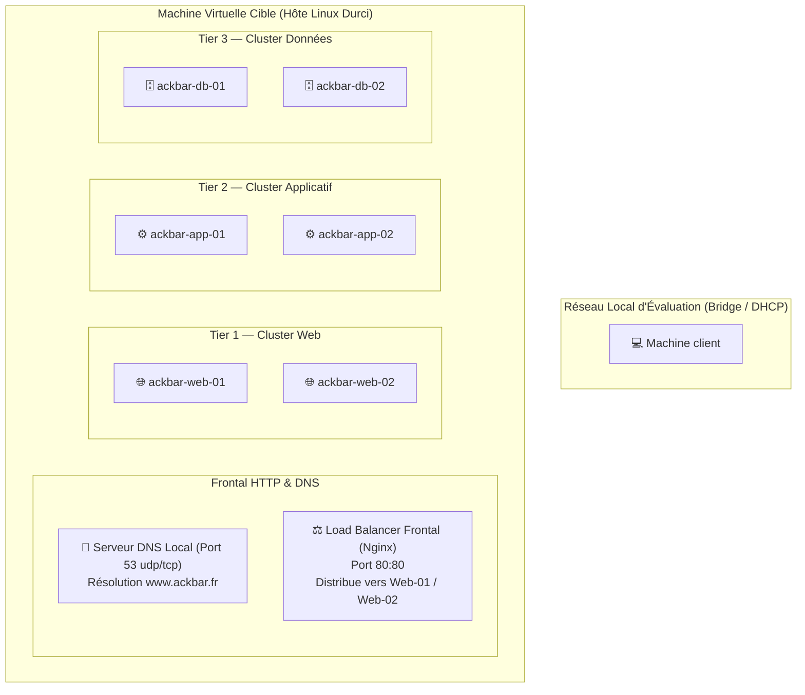

# 🦑 Wargame ESD — Opération Ackbar Industries

<div align="center">


<br/>

```text
       ___        _     _                   ___           _           _        _           
      / _ \      | |   | |                 |_ _|         | |         | |      (_)          
     / /_\ \ ___ | | __| |__   __ _ _ __    | | _ __   __| |_   _ ___| |_ _ __ _  ___  ___ 
     |  _  |/ __|| |/ /| '_ \ / _` | '__|   | || '_ \ / _` | | | / __| __| '__| |/ _ \/ __|
     | | | | (__ |   < | |_) | (_| | |     _| || | | | (_| | |_| \__ \ |_| |  | |  __/\__ \
     \_| |_/\___||_|\_\|_.__/ \__,_|_|    |___/|_| |_|\__,_|\__,_|___/\__|_|  |_|\___||___/
```

**Épreuve d'audit offensif, d'évasion de conteneur et d'investigation numérique (Threat Hunting).**

[📜 Ordre de Mission](#-contexte--scénario-immersif) • [🏗️ Architecture](#-%EF%B8%8F-architecture-cible) • [🚀 Démarrage Rapide](#-démarrage-rapide) • [🎯 Objectifs](#-objectifs-de-la-mission) • [⚖️ Règles](#%EF%B8%8F-règles-dengagement) • [💡 Indices](#-indices-progressifs)

</div>

---

## 📜 Contexte & Scénario Immersif

> **RÉFÉRENCE DE L'ALERTE :** `CERTFR-2026-ALE-ACKBAR`  
> **DATE D'INTERVENTION :** Juillet 2026  
> **COMMANDITAIRE :** Agence Nationale de la Sécurité des Systèmes d'Information (ANSSI)  
> **CIBLE AUDITÉE :** Ackbar Industries Inc. (`www.ackbar.fr`)  

### 🚨 Le Briefing Opérationnel

**Ackbar Industries**, sous-traitant stratégique et équipementier de systèmes spatiaux et maritimes, subit de graves perturbations sur sa nouvelle plateforme e-commerce haute disponibilité.

Selon les premiers signalements reçus par le **CERT-FR**, des requêtes anormales et des transferts suspects ont été constatés de nuit vers des adresses IP extérieures non répertoriées. Le groupe cybercriminel étatique **PandaBytes** est soupçonné d'avoir pris pied sur l'infrastructure en exploitant une mauvaise configuration de surface et des failles dans le découpage applicatif en micro-services.

L'équipe d'exploitation d'Ackbar Industries a tenté d'effacer les traces de panique, mais l'infrastructure semble compromise en profondeur : des bases de données ont été chiffrées et une archive sensible a été exfiltrée puis dissimulée localement.

**Votre mission :**  
En tant qu'opérateurs mandatés par l'ANSSI, vous devez mener un test d'intrusion réaliste sur l'infrastructure d'Ackbar Industries, retracer la chaîne d'attaque (kill chain), échapper au cloisonnement des conteneurs, investiguer les traces laissées par l'attaquant et **récupérer la preuve technique irréfutable : le Flag de validation**.

---

## 🏗️ Architecture Cible

L'infrastructure cible repose sur une pile **micro-services 3-tiers redondée** orchestrée sous Docker et exposée via un répartiteur de charge :



---

## 🚀 Démarrage Rapide

### 1. Prérequis Matériels & Logiciels
* **Hyperviseur :** [Oracle VirtualBox 7.x](https://www.virtualbox.org/) (recommandé) ou compatible OVF 2.0 / OVA.
* **Ressources VM minimales :** 2 vCPU, 4 Go RAM, 25 Go de stockage.
* **Système d'attaque :** Kali Linux, Parrot Security OS ou toute distribution Linux équipée d'outils de pentest réseau et web.

### 2. Importation de l'Appareil Virtuel (`.ova`)
1. Dans VirtualBox : **Fichier > Importer un appareil virtuel...**
2. Sélectionnez l'image `ESD-Wargame-Ackbar-Industries.ova`.
3. Validez l'importation.

### 3. Configuration du Réseau
La VM est paramétrée par défaut en **Accès par pont (Bridged Adapter)** pour recevoir une adresse IP via le serveur DHCP de votre réseau local, exactement comme un équipement d'entreprise réel.

* Si vous travaillez en environnement isolé (PC portable sans box/switch), vous pouvez basculer l'interface de la VM et de votre Kali en mode **Réseau hôte (Host-Only)** ou sur un même **Réseau NAT (NAT Network)**.

### 4. Démarrage & Identification de la Cible
Démarrez la machine virtuelle. Dès que la console s'affiche :
* L'écran d'accueil (`/etc/issue`) affiche automatiquement l'adresse IP attribuée dynamiquement à la VM.
* Si vous n'avez pas accès à l'écran, découvrez l'IP sur votre réseau :
  ```bash
  sudo arp-scan --localnet
  # ou
  sudo netdiscover -r 192.168.1.0/24
  ```

### 5. Résolution du Nom de Domaine `www.ackbar.fr`
Pour naviguer sur la boutique en ligne d'Ackbar Industries, deux méthodes s'offrent à vous :

* **Option A — Résolution DNS automatique (Intégrée à la VM) :**  
  La VM embarque son propre serveur DNS sur le port 53 qui résout dynamiquement `www.ackbar.fr` vers sa propre adresse IP. Configurez le résolveur DNS de votre machine d'attaque sur l'IP de la VM :
  ```bash
  # Test rapide via dig
  dig @<IP_DE_LA_VM> www.ackbar.fr
  ```

* **Option B — Fichier Hosts local (Recommandé & Rapide) :**  
  Ajoutez l'entrée dans votre fichier `/etc/hosts` (Linux/macOS) ou `C:\Windows\System32\drivers\etc\hosts` (Windows) :
  ```text
  <IP_DE_LA_VM>    www.ackbar.fr ackbar.fr
  ```

Ouvrez ensuite votre navigateur sur `http://www.ackbar.fr` ! 🚀

---

## 🎯 Objectifs de la Mission

Le wargame est découpé en **5 phases chronologiques** suivant le framework **MITRE ATT&CK** :

```text
[Phase 1 : Reconnaissance] ➔ [Phase 2 : Accès Initial] ➔ [Phase 3 : Évasion Docker] ➔ [Phase 4 : Threat Hunting] ➔ [Phase 5 : Capture du Flag]
```

| Phase | Objectif Opérationnel | Techniques Clés |
| :---: | :--- | :--- |
| **01** | **Cartographie & Empreinte** | Scan de ports, énumération des en-têtes HTTP du Load Balancer, identification des services exposés. |
| **02** | **Accès Initial** | Découverte d'un point d'accès d'administration distant, analyse de faiblesse d'authentification et obtention d'un shell. |
| **03** | **Évasion de Bac à Sable** | Audit de l'environnement conteneurisé, détection des permissions abusives et pivot vers le système hôte (*Container Escape*). |
| **04** | **Investigation Numérique** | Analyse des mécanismes de persistance, traque des journaux d'activité, détection du serveur de Command & Control (C2). |
| **05** | **Cryptanalyse & Flag** | Découverte d'artefacts dissimulés, cassage de condensat cryptographique et déchiffrement de l'archive finale. |

---

## ⚖️ Règles d'Engagement

* ✅ **Périmètre autorisé :** Uniquement la machine virtuelle du challenge.
* ❌ **Pas de Déni de Service :** Les attaques par déni de service (Syn Flood, DoS/DDoS, saturation de bande passante, fork-bombs) sont formellement prohibées et ne font pas partie de la résolution.
* ❌ **Pas de force brute aveugle :** Les accès faibles peuvent être trouvés avec des dictionnaires standards usuels (`rockyou.txt`) sans nécessiter des millions de requêtes par seconde. Limitez vos threads pour préserver la stabilité des services.
* ❌ **Ne touchez pas à la console GRUB / TPM de l'hyperviseur :** Le challenge se résout à 100 % par le réseau et l'analyse système, conformément aux standards des compétitions professionnelles.
* 🚩 **Format du Flag :** Le flag respecte strictement la syntaxe :
  ```text
  ESD{........................}
  ```

---

## 🛠️ Boîte à Outils Conseillée

Les outils classiques de sécurité offensive et d'investigation numérique sont recommandés :

* **Reconnaissance & Scan :** `nmap`, `netcat`, `curl`, `whatweb`
* **Énumération Web :** `gobuster`, `ffuf`, `Burp Suite`, `OWASP ZAP`
* **Audit d'Authentification :** `hydra`, `medusa`, `ssh`
* **Dictionnaire :** `rockyou.txt`
* **Post-Exploitation & Docker :** `docker-cli`, `chroot`, scripts d'énumération Linux (`linpeas.sh`)
* **Cassage de Hash & Déchiffrement :** `john the ripper`, `hashcat`, `unzip`, `openssl`
* **Forensic :** `journalctl`, `grep`, `awk`, `find`, `stat`

---

## 💡 Indices Progressifs

Vous êtes bloqué sur une étape ? Déroulez les indices ci-dessous un par un.

<details>
<summary>🔍 Indice 1 — Phase de Reconnaissance & Services</summary>

* Les ports habituels ne sont pas les seuls à écouter. Avez-vous scanné l'ensemble des ports TCP standards (`-p 22,80,443,2222,8080`) ?
* Inspectez attentivement les en-têtes HTTP retournés par `curl -I http://www.ackbar.fr`. Vous remarquerez que deux serveurs web backend se partagent le trafic derrière un équilibreur Nginx.
* Le service SSH qui écoute sur le port standard `22` ne correspond pas au système hôte, mais à un des conteneurs applicatifs frontaux.
</details>

<details>
<summary>🔑 Indice 2 — Accès Initial & Compte Utilisateur</summary>

* L'utilisateur système courant pour l'administration du conteneur est `admin`.
* Le mot de passe utilisé est un mot de passe simple inspiré de l'univers d'Ackbar (l'amiral Mon Calamari) et présent dans les premières dizaines de milliers de lignes du dictionnaire `rockyou.txt`.
* Un brute-force ciblé avec `hydra` sur le service SSH du port `22` portera ses fruits en quelques secondes.
</details>

<details>
<summary>🚪 Indice 3 — Évasion de Conteneur (Container Escape)</summary>

* Une fois connecté en tant qu'administrateur dans le conteneur, inspectez vos privilèges (`sudo -l`) et les systèmes de fichiers montés (`df -h`, `mount`).
* Remarquez-vous un dossier `/mnt/host_root` ? Ce volume donne un accès direct à l'arborescence racine `/` du système hôte !
* Que se passe-t-il si vous exécutez un changement de racine d'exécution (`chroot`) ?
</details>

<details>
<summary>🕵️ Indice 4 — Threat Hunting, Persistance & C2</summary>

* L'attaquant a planifié des tâches automatiques pour maintenir sa présence et exfiltrer des données. Regardez dans `/etc/cron*` ou `/var/spool/cron/crontabs/`.
* Une tâche d'exfiltration nocturne pointe vers une adresse IP C2 externe. Quel script est invoqué ?
* Les attaquants laissent souvent des artefacts volatils dans les répertoires partagés en mémoire vive, comme `/dev/shm` ou `/tmp`.
* Avez-vous cherché des fichiers cachés (`ls -la /dev/shm`) ?
</details>

<details>
<summary>🏆 Indice 5 — Déchiffrement & Récupération du Flag</summary>

* Une archive `.zip` cachée se trouve dans `/dev/shm`. Elle est protégée par un mot de passe.
* L'administrateur (ou l'attaquant) a laissé un hash MD5 en commentaire dans un fichier de configuration critique de `root` (`/root/.ssh/config`).
* Ce hash MD5 correspond à un mot de passe classique avec substitutions (leetspeak, symbole `@`). Il se casse quasi instantanément avec John the Ripper (`john --format=raw-md5 --wordlist=rockyou.txt hash.txt`) ou Hashcat.
* Décompressez l'archive avec ce mot de passe pour afficher `flag.txt` !
</details>

---

## 📊 Matrice d'Évaluation (Critères Académiques)

La résolution de ce wargame permet de valider les compétences suivantes :

| Compétence Évaluée | Critère de Succès | Pondération Indicative |
| :--- | :--- | :---: |
| **Reconnaissance & Scan** | Détection du load balancer, cartographie des services et des nœuds backend | 15 % |
| **Intrusion Initiale** | Prise de pied réussie sur le conteneur frontal | 20 % |
| **Évasion de Bac à Sable** | Élévation de privilèges vers l'hôte via les montages Docker | 25 % |
| **Investigation Forensic** | Identification de la persistance cron, de l'IP C2 et des traces d'effacement | 20 % |
| **Cryptanalyse & Flag** | Cassage du condensat MD5, extraction de l'archive et soumission du flag exact | 20 % |

---

## 👥 Crédits & Remerciements

* **Conception & Scénarisation :** Équipe Wargame ESD Cybersecurity Academy
* **Scénario Thématique :** Ackbar Industries & Threat Actor PandaBytes
* **Référentiel Technique :** MITRE ATT&CK Framework v14 (T1190, T1078, T1046, T1611, T1053.003, T1070.004, T1027, T1048.003)
* **Supervision Pédagogique :** ESD Cybersecurity Academy — Module Wargame

---

<div align="center">
  <b>« It's a trap! ... Sauf si vous auditez rigoureusement l'infrastructure. »</b><br/>
  <i>Bonne chance à tous les participants ! 🛡️</i>
</div>
